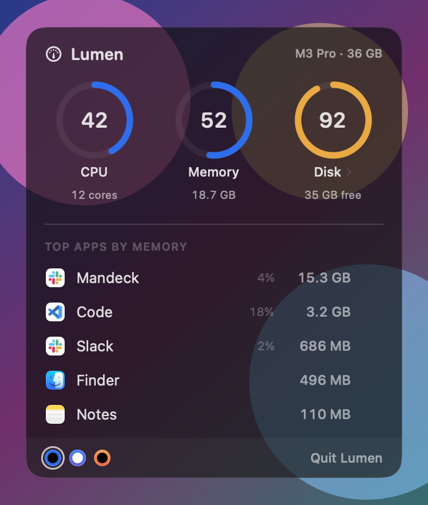
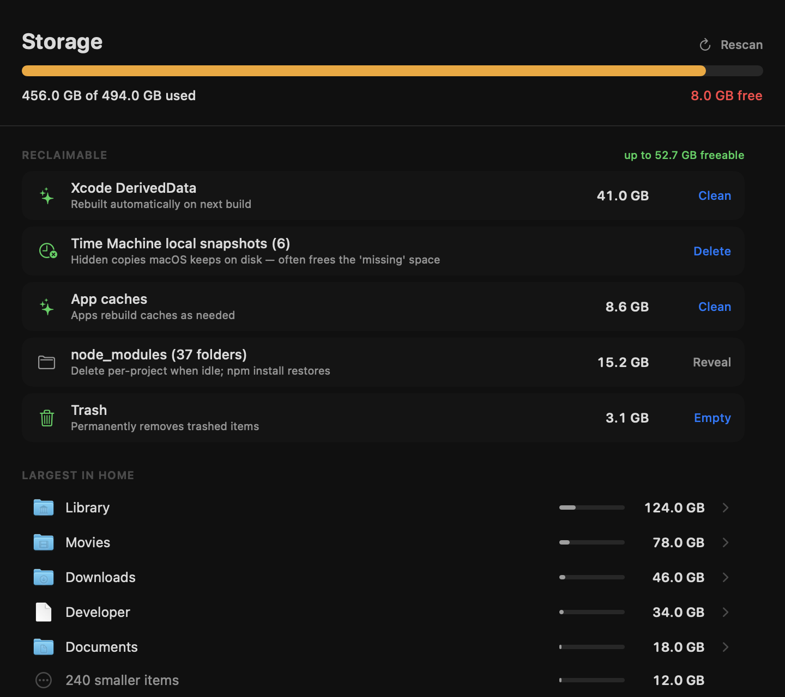
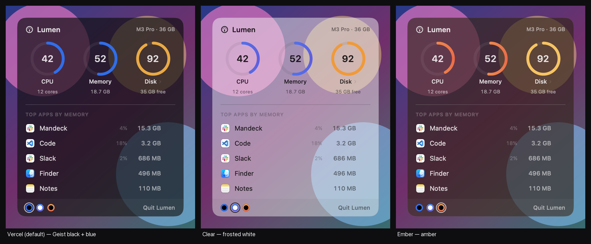

# Lumen

A beautiful, featherweight system monitor that lives in your Mac's menu bar —
and tells you exactly where your disk space went.

See CPU, memory, and disk at a glance, quit a runaway app in one click, then open
**Storage** to find (and safely clear) the caches, build junk, and hidden
snapshots eating your SSD.



## Why

Activity Monitor is heavy and buried; DaisyDisk is a separate paid app. Lumen is
one quiet line in your menu bar that opens into both: a live system panel and an
on-demand storage explorer. It's built to catch the next *"Your system has run
out of application memory"* — and the next *"your disk is almost full"* — before
they happen.

## What it does

**Menu bar** — a live CPU sparkline plus the one number that predicts trouble
(memory %). Stays monochrome and calm; warms to orange, then red, only under
pressure.

**System panel** (click the menu bar) — CPU / Memory / Disk ring gauges over the
top memory-hungry apps, each with its real icon. Quit an app with the ⏏ button
(`SIGTERM`), or ⌥-click to force quit (`SIGKILL`).

**Storage** (click the Disk ring) — an on-demand scan of where your space lives:



- **Reclaimable** — dev-aware cleanup that targets the real culprits: Xcode
  DerivedData, iOS DeviceSupport, simulator caches, `~/Library/Caches`,
  `~/.cache`, npm/pnpm stores, the Trash, and **APFS local snapshots** (the
  hidden Time Machine copies behind a bloated "System Data"). One click to clear,
  with a confirmation showing exactly how much you'll free.
- **Largest in Home** — the biggest folders, with real icons and a share-of-disk
  bar, drill-down navigable, with Reveal in Finder.
- node_modules, Docker data, and Xcode Archives are surfaced but reveal-only —
  Lumen won't delete things that are painful to rebuild.

## Themes

Lumen is built on real translucency (frosted "liquid glass" that samples your
desktop). Three built-in themes, switchable from the swatches in the panel footer
and remembered across launches:



**Vercel** (default, Geist black + signature blue) · **Clear** (frosted white) ·
**Ember** (amber). Every theme keeps the same severity signal — rings and bars
warm to amber, then red, as load climbs.

## Design principles

- **Light by default.** ~14 MB idle. No subprocesses or daemons for monitoring —
  CPU, RAM, and disk are read straight from the kernel (Mach `host_statistics`,
  `libproc` `proc_pid_rusage`). The menu bar samples every 2 s; the process list
  only while the panel is open; the disk scan only when you open Storage.
- **Quiet until it matters.** Color appears only when something needs attention.
- **Native, not generic.** AppKit + SwiftUI, real app icons, SF typography,
  system materials. It looks like it shipped with macOS.
- **Safe.** Destructive cleanup always confirms first and only ever targets
  regenerable files; your own documents are reveal-only.

## Install

Requires macOS 14+ and a Swift toolchain (Xcode or Command Line Tools).

```bash
git clone https://github.com/sonpiaz/lumen.git
cd lumen
./scripts/build-app.sh release
open dist/Lumen.app
```

Launch at login: System Settings → General → Login Items → add `Lumen.app`.
For complete disk results, grant Full Disk Access (Lumen prompts you when needed).

## How the numbers are derived

| Metric | Source |
|---|---|
| CPU % | `host_processor_info` tick deltas, normalized across all cores |
| Memory used | App (internal − purgeable) + wired + compressed pages — matches Activity Monitor |
| Disk | `volumeAvailableCapacityForImportantUsage` on the data volume |
| Per-app memory | `proc_pid_rusage` physical footprint, helpers grouped under their parent `.app` |
| Folder sizes | recursive `totalFileAllocatedSize` — byte-for-byte equal to `du` |

## Verify it yourself

```bash
.build/release/Lumen --selftest          # one live CPU/RAM/disk sample vs top/vm_stat
.build/release/Lumen --scan-test <path>  # folder size vs `du -sk`
.build/release/Lumen --scan-home         # full home scan with timing
```

## License

MIT © 2026 Son Nguyen
