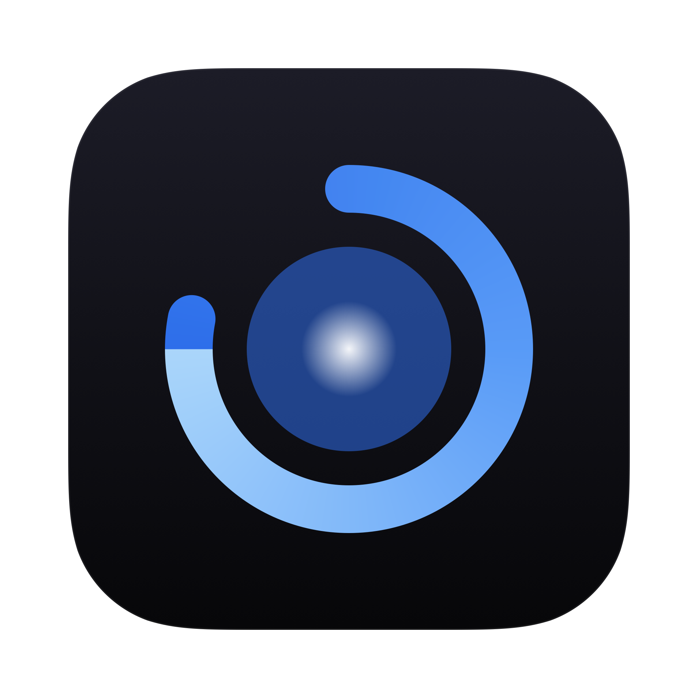
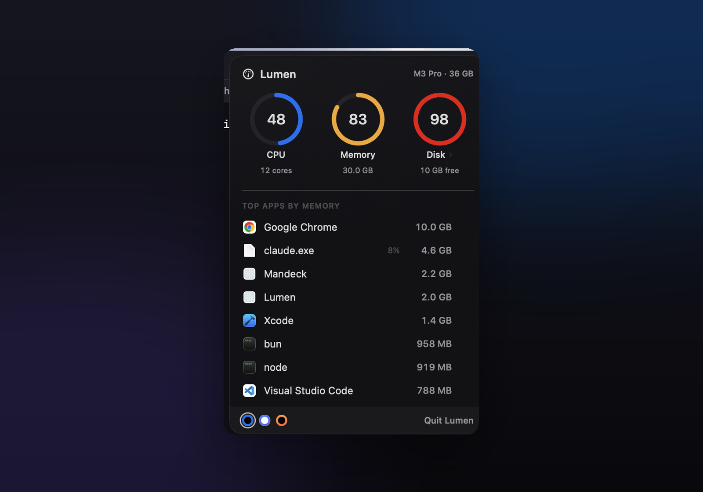
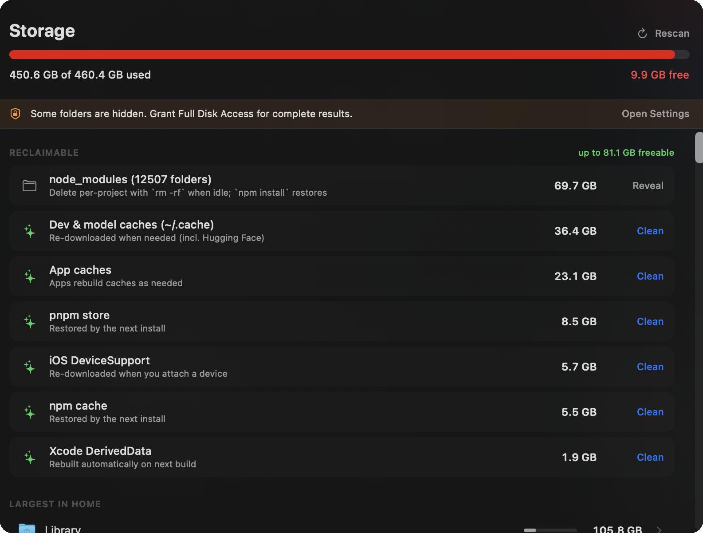

# Lumen — a beautiful macOS menu bar system monitor

[](https://github.com/sonpiaz/lumen/releases/latest) · signed &amp; notarized by Apple · macOS 14+ · ~14 MB

Live **CPU, memory, and disk** monitoring in your Mac's menu bar, plus a
dev-aware **storage cleaner** that shows exactly what's filling your SSD and
clears it in one click. A lightweight, native **Activity Monitor alternative**
for developers — Apple Silicon and Intel, macOS 14+.



## The problem

You're deep in a build: a dozen terminal tabs, Chrome with forty tabs, VS Code,
Docker, a simulator. Memory climbs invisibly. Then macOS throws **"Your system
has run out of application memory,"** force-quits your apps, and the working
session you spent all afternoon building is gone. Meanwhile your SSD quietly
fills with `node_modules` and caches until there's no headroom left to swap — so
it happens sooner, and more often.

The numbers that predict that moment already exist. They're just buried three
clicks deep in Activity Monitor, where you'll never look in time.

## The fix

Lumen keeps them one glance away. A quiet line in your menu bar shows live CPU
and the memory % that actually predicts trouble — it warms to amber, then red, as
pressure builds, so you quit Chrome *before* the crash, not after. Click it for
ring gauges and the top memory-hungry apps (real icons, one-click quit). Click
the disk ring to find and safely reclaim tens of gigabytes of build junk.

No subprocesses, no daemons, ~14 MB of RAM — it reads straight from the kernel.

## What it does

**Menu bar** — a live CPU sparkline plus the one number that predicts trouble
(memory %). Stays monochrome and calm; warms to orange, then red, only under
pressure.

**System panel** (click the menu bar) — CPU / Memory / Disk ring gauges over the
top memory-hungry apps, each with its real icon. Quit an app with the ⏏ button
(`SIGTERM`), or ⌥-click to force quit (`SIGKILL`).

**Storage** (click the Disk ring) — an on-demand scan of where your space lives:



- **Reclaimable** — dev-aware cleanup that targets the real culprits: Xcode
  DerivedData, iOS DeviceSupport, simulator caches, `~/Library/Caches`,
  `~/.cache`, npm/pnpm stores, the Trash, and **APFS local snapshots** (the
  hidden Time Machine copies behind a bloated "System Data"). One click to clear,
  with a confirmation showing exactly how much you'll free.
- **Largest in Home** — the biggest folders, with real icons and a share-of-disk
  bar, drill-down navigable, with Reveal in Finder.
- node_modules, Docker data, and Xcode Archives are surfaced but reveal-only —
  Lumen won't delete things that are painful to rebuild.

## Themes

Lumen is built on real translucency (frosted "liquid glass" that samples your
desktop). Three built-in themes, switchable from the swatches in the panel footer
and remembered across launches:


**Vercel** (default, Geist black + signature blue) · **Clear** (frosted white) ·
**Ember** (amber). Every theme keeps the same severity signal — rings and bars
warm to amber, then red, as load climbs.

## Design principles

- **Light by default.** ~14 MB idle. No subprocesses or daemons for monitoring —
  CPU, RAM, and disk are read straight from the kernel (Mach `host_statistics`,
  `libproc` `proc_pid_rusage`). The menu bar samples every 2 s; the process list
  only while the panel is open; the disk scan only when you open Storage.
- **Quiet until it matters.** Color appears only when something needs attention.
- **Native, not generic.** AppKit + SwiftUI, real app icons, SF typography,
  system materials. It looks like it shipped with macOS.
- **Safe.** Destructive cleanup always confirms first and only ever targets
  regenerable files; your own documents are reveal-only.

## Install

**Download** the latest [`Lumen.dmg`](https://github.com/sonpiaz/lumen/releases/latest),
open it, and drag **Lumen** to Applications. It's signed and notarized by Apple,
so it opens normally — no right-click needed. macOS 14+, Apple Silicon & Intel.

Or build from source (needs a Swift toolchain):

```bash
git clone https://github.com/sonpiaz/lumen.git
cd lumen
./scripts/build-app.sh release
open dist/Lumen.app
```

Launch at login: System Settings → General → Login Items → add `Lumen.app`.
For complete disk results, grant Full Disk Access (Lumen prompts you when needed).
Maintainers: see [docs/RELEASE.md](docs/RELEASE.md) for the signed-and-notarized release flow.

## How the numbers are derived

| Metric | Source |
|---|---|
| CPU % | `host_processor_info` tick deltas, normalized across all cores |
| Memory used | App (internal − purgeable) + wired + compressed pages — matches Activity Monitor |
| Disk | `volumeAvailableCapacityForImportantUsage` on the data volume |
| Per-app memory | `proc_pid_rusage` physical footprint, helpers grouped under their parent `.app` |
| Folder sizes | recursive `totalFileAllocatedSize` — byte-for-byte equal to `du` |

## Verify it yourself

```bash
.build/release/Lumen --selftest          # one live CPU/RAM/disk sample vs top/vm_stat
.build/release/Lumen --scan-test <path>  # folder size vs `du -sk`
.build/release/Lumen --scan-home         # full home scan with timing
```

## FAQ

**Is this an Activity Monitor alternative?** Yes — a lighter, always-visible one
for the three numbers you check most (CPU, memory, disk) plus one-click app
quitting.

**Will it slow my Mac down?** No. ~14 MB idle, no background daemons; the menu
bar samples twice a second and the disk scan only runs when you open Storage.

**Is deleting caches safe?** Lumen only ever offers to clear regenerable files
(caches, DerivedData, the Trash, local snapshots), always behind a confirmation.
Your documents and source are reveal-only.

**Does it phone home?** No network access at all. Everything is local.

## License

MIT © 2026 Son Nguyen

---

<sub>macOS system monitor · menu bar CPU / RAM / disk monitor · Activity Monitor
alternative · free up disk space on Mac · reclaim SSD storage · clear
node_modules & Xcode DerivedData · fix "your system has run out of application
memory" · Apple Silicon (M1/M2/M3) & Intel · Swift · SwiftUI · liquid glass</sub>
